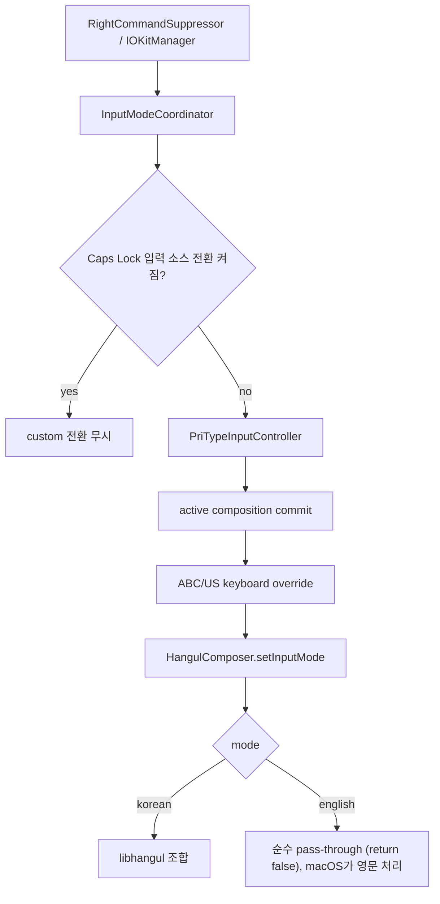

# 아키텍처

## 구조

```
┌──────────────────────────────────────────────────────────┐
│  macOS                                                   │
│                                                          │
│  ┌─────────────┐    IMK 프로토콜     ┌────────────────┐  │
│  │ 앱 텍스트필드 │ ◄──────────────── │ IMKServer      │  │
│  └─────────────┘                    └───────┬────────┘  │
│                                             │            │
│  ┌──────────────────────────────────────────┼─────────┐  │
│  │ PriType.app                              │         │  │
│  │                                          ▼         │  │
│  │  ┌──────────────────────┐ 세션관리 ┌───────────┐   │  │
│  │  │ PriTypeInputController│ ──────► │InputSession│   │  │
│  │  │ (IMKInputController) │         │(finalize 단일)│ │  │
│  │  └──────────────────────┘         └─────┬─────┘   │  │
│  │                                          │adapter  │  │
│  │  ┌──────────────────────┐         ┌─────▼─────┐   │  │
│  │  │ClientContextDetector │         │HangulComposer│ │  │
│  │  │(컨텍스트 분석)         │         │(libhangul)│   │  │
│  │  └──────────────────────┘         └─────┬─────┘   │  │
│  │                                          │         │  │
│  │  ┌──────────────────────┐  ┌─────────────▼──────┐  │  │
│  │  │TextDelivery 어댑터 3종 │  │HanjaCandidateWindow│  │  │
│  │  │(marked/direct/immediate)│ │(SwiftUI 후보 패널) │  │  │
│  │  └──────────────────────┘  └────────────────────┘  │  │
│  │                                                    │  │
│  │  ┌──────────────────────┐  ┌────────────────────┐  │  │
│  │  │RightCommandSuppressor│  │IOKitManager        │  │  │
│  │  │(CGEventTap, 주 핸들러)│  │(IOHIDManager, 백업) │  │  │
│  │  └──────────────────────┘  └────────────────────┘  │  │
│  └────────────────────────────────────────────────────┘  │
└──────────────────────────────────────────────────────────┘
```

## 입력 처리 흐름

프로세스 전역 `InputModeStore`가 한/영 선택을 보존하고, `ActiveOwnerHandoffRegistry`가 한 번에
하나의 active controller만 공개한다. 각 controller는 client별 `InputSession`을 소유하며 조합
상태를 다른 client와 공유하지 않는다.

```text
activateServer
  └─ ActiveOwnerHandoffRegistry.claim
       ├─ 이전 controller retire
       │    └─ session.finalize(.sessionReplacement)
       └─ 새 controller 공개
```

키 입력·한/영 전환·조합 종료는 client를 소유한 `InputSession`을 중심으로 연결된다.

```
keyDown ──► PriTypeInputController.handle()
              1. ensureSession(client)      ← 클라이언트 변경/포커스 복귀 시 컨텍스트 재분석
              2. 중복 keyDown 억제           ← 동일 물리 이벤트 2회 전달 호스트(예: KakaoTalk) 방어, 전 모드 공통
              3. markKeystroke(bundleId)    ← 한자 cross-app 검증용
              4. Secure Input 게이트         ← 통과 시 session.discardForSecureInput() 후 raw pass-through
              5. pending 소유권 정합화       ← 실제 macOS 입력 소스 경계만, Secure Input 통과 후 적용
              6. ensureAdapterMatchesPolicy ← 실험 플래그 토글 등 delivery 모드 변경 반영
              7. HangulComposer.handle(event, delegate: session.adapter)

조합 종료(어떤 이유든) ──► InputSession.finalize(reason:)   ★ 단일 경로
              • appDeactivate        — NSWorkspace 비활성 옵저버 (가장 이른 시점, 호스트가 아직 insertText를 수용)
              • deactivateServer     — IMK 포커스 전환 (fallback, 멱등)
              • mouseCommit          — 조합 영역 외 클릭
              • modeTransition       — 사용자 한/영 전환키
              • inputSourceOwnership — macOS 소유권 활성화/ABC→PriType 복귀
              • keyboardLayoutChange — 두벌식/세벌식 전환
              • sessionReplacement   — 새 controller/client가 먼저 활성화
              • deliveryModeChange   — marked/direct 정책 변경
```

1. macOS가 키 이벤트를 `PriTypeInputController.handle()`에 전달한다.
2. `ensureSession()`이 클라이언트·`ClientContext`·delivery 어댑터·중복키 상태·포커스 안전망을 묶은 `InputSession`을 반환한다(같은 클라이언트면 재사용, 다르면 재분석 후 교체).
3. Secure Input·중복 keyDown 판정을 통과하면 `HangulComposer.handle()`에 위임한다.
4. `HangulComposer`는 libhangul-swift의 `ThreadSafeHangulInputContext`로 한글 조합을 수행하고, preedit과 commit을 어댑터 콜백으로 전달한다.
5. `TextDelivery`의 어댑터(`MarkedTextAdapter` / `DirectInsertionAdapter` / `ImmediateModeAdapter`)가 `IMKTextInput` 프로토콜로 텍스트를 앱에 전달한다. 모드 선택은 `TextDeliveryPolicy.mode(for:)` 한 곳에서 결정한다.

### 조합 종료 단일 경로 (InputSession.finalize)

과거 KakaoTalk 계열 버그(stranded preedit, 마지막 글자 유실, 이모티콘 팝업 깜빡임)는 조합 종료 이벤트마다 commit 시퀀스가 조금씩 달랐던 데서 왔다. 현재는 모든 종료 이벤트가 `InputSession.finalize(reason:)` 하나로 수렴한다. marked-text 경로는 `replacementRange = NSNotFound`인 canonical 1-op commit을 사용한다. 직접 삽입 경로는 이미 문서에 있는 실제 텍스트를 재삽입하지 않고 엔진만 flush하며, PriType가 만든 stale marked fallback만 소유 범위를 확인한 뒤 정리한다.

- 포커스 상실: 세션이 소유한 `NSWorkspace` 비활성 옵저버가 IMK `deactivateServer`보다 먼저 finalize한다(네이티브 호스트가 이미 resign한 뒤의 insertText는 무시되기 때문). 옵저버는 세션 자신의 앱과만 비교하며, `deactivateServer`에서 반드시 disarm해 stale 옵저버가 이후 세션의 조합을 엉뚱한 클라이언트로 흘리는 것을 막는다.
- controller 교체: 새 controller의 `activateServer`가 이전 controller의 늦은 `deactivateServer`보다 먼저 올 수 있다. 새 owner를 공개하기 전에 이전 session을 `.sessionReplacement`로 finalize하고 옵저버를 해제한다. 늦게 도착한 이전 controller의 release는 새 owner를 지우지 못한다.
- 마우스 클릭: `flagsChanged`를 포함한 입력기는 InputMethodKit의 기본 외부-click commit 대상이 아니므로 mouse-down mask와 `IMKMouseHandling` callback을 명시적으로 등록한다. marked range 밖 클릭 또는 marked range가 없는 직접 삽입 클릭만 finalize하고, 실제 caret 이동은 호스트에 통과시킨다.
- 직접 삽입(실험) 모드: 조합 글자가 실제 텍스트인 동안은 재삽입 없이 엔진만 flush한다. 문서 접근 실패로 marked text에 fallback한 상태는 canonical marked finalize를 사용하고, PriType가 소유한 잔여 marked range만 안전하게 정리한다.

## 한/영 전환 흐름

`RightCommandSuppressor`가 `CGEventTap`으로 시스템 레벨 키 이벤트를 가로채서 사용자가 설정한 전환키(기본: 우측 Command)와 한자키(기본: 우측 Option)를 처리한다. Key Recorder 방식으로 아무 키나 등록할 수 있다. `CGEventTap`은 일시 비활성화 시 물리 modifier 상태를 다시 동기화해 재활성화한다. 60초 안에 세 번째 비활성화가 발생하면 tap 자원을 먼저 완전히 해제한 뒤 IOKit으로 영구 인계한다. `ToggleMonitorStatusStore`가 시작 권한과 상태를 직렬화하므로 두 backend가 동시에 입력을 소유하지 않는다. IOKit fallback은 HID 매핑 가능한 modifier-only 바인딩만 지원하며, regular/combo 바인딩은 임의로 흉내 내지 않고 상태바의 제한 사항으로 노출한다.

현재 한/영 전환 구조의 정식 명세는 [UnifiedInputArchitecture.md](Docs/UnifiedInputArchitecture.md)다(선택지 비교 원본은 [InputArchitectureHybridRollbackPlan.md](Docs/InputArchitectureHybridRollbackPlan.md), superseded). 핵심은 custom 전환키 경로에서 실제 ABC 입력 소스를 선택하지 않고, PriType 내부 mode 전환을 단일 트랜잭션으로 처리하는 것이다. 이 경로에서는 PriType 단일 입력 소스가 IMK 세션을 계속 소유하고, 영어는 조합 없이 raw key를 그대로 pass-through한다. Caps Lock 기반 실제 입력 소스 전환은 macOS가 소유한다.



이 구조에서 `InputSourceManager`는 입력 소스 전환의 주체가 아니다. TIS 목록 조회, stale entry 정리, 설치/마이그레이션 보조만 담당한다. 전환 hot path에 `TISSelectInputSource(com.apple.keylayout.ABC)`가 들어오면 2.7대에서 관찰된 한/영 씹힘과 모드 불일치가 재발할 수 있다.

### 전환 상태 소유권

| 상태 | 소유자 | 원칙 |
|---|---|---|
| 전환 요청 정책 | `InputModeCoordinator` | Caps Lock 정책과 active controller fallback을 한 곳에서 판단한다. |
| 실제 조합 모드 | `HangulComposer.inputMode` | 2.6.5처럼 PriType 내부 mode의 source of truth다. |
| host input mode 표시 | macOS TIS | custom 전환키에서는 입력 소스를 바꾸지 않으므로 메뉴바 source는 PriType 단일 항목으로 유지한다. |
| macOS 실제 입력 소스 | macOS TIS | custom 전환키에서는 건드리지 않는다. Caps Lock 경로에서만 시스템이 소유한다. |
| 영어 레이아웃 | IMK session | `overrideKeyboardWithKeyboardNamed`로 ABC/US 계열 layout을 요청한다. |

PriType의 `ComponentInputModeDict`는 단일 mode `com.pritype.inputmethod.v2`만 등록한다. 내부 한/영 상태는 `HangulComposer.inputMode`가 들고, custom 전환키는 실제 Apple `ABC` source나 별도 English input mode를 선택하지 않는다.

## 한자 후보창 좌표 결정

한자 후보창을 커서 근처에 표시하기 위해 앱으로부터 커서의 화면 좌표를 얻어야 한다. 네이티브 앱(TextEdit, Xcode 등)에서는 `IMKTextInput.firstRect(forCharacterRange:)` 하나로 충분하지만, Chromium 계열 앱(Chrome, Edge, VS Code 등)은 한자키 이벤트 처리 중에 좌표 API를 차단한다.

### 좌표 조회 전략

한자키가 눌렸을 때 다음 순서로 유효한 좌표를 탐색한다:

1. **firstRect**: `IMKTextInput.firstRect(forCharacterRange:)`로 marked range의 화면 좌표를 조회한다. 네이티브 앱에서는 대부분 여기서 성공한다.

2. **attributes**: `IMKTextInput.attributes(forCharacterIndex:lineHeightRectangle:)`로 문자 위치의 line height rectangle을 조회한다. `firstRect`가 쓰레기값을 반환할 때 대안으로 사용한다.

3. **캐시 (proactive)**: `handle()` 메서드에서 한글 입력 중 매 키스트로크마다 `firstRect`와 `attributes`를 호출하여 `lastKnownCursorRect`에 저장한다. Chromium은 일반 타이핑 중에는 좌표를 정상 반환하므로, 한자키를 누르기 전에 캐시가 채워져 있다. fcitx5-macos의 `setController` 접근법에서 착안했다.

4. **Accessibility API**: `AXUIElementCopyAttributeValue`로 포커스된 텍스트 필드의 `AXBounds`와 `AXSelectedTextRange`를 조회한다. 접근성 권한이 필요하며, Chromium의 내부 텍스트 필드에서는 `-25212 (kAXErrorCannotComplete)` 에러가 발생할 수 있다.

5. **마우스 위치**: 위 전략이 모두 실패하면 `NSEvent.mouseLocation`을 사용한다. 커서 근처에서 한자키를 누르는 일반적인 사용 패턴에서 대체로 수용 가능한 위치를 제공한다.

### 좌표 유효성 검증

`isValidCursorRect()`로 반환된 좌표가 실제로 사용 가능한지 검증한다. Chromium이 반환하는 대표적인 쓰레기값:

- 전체 0: `(0, 0, 0, 0)` — 좌표 조회 실패
- 비정규화 부동소수점: `(1.6e-314, 95886, 1.6e-314, -1)` — 초기화되지 않은 메모리
- 음수 height: `(x, y, w, -1)` — 비정상 응답

검증 기준: 모든 값이 유한하고 width ≥ 0, height > 0이며, 0이 아닌 subnormal 값을 포함하지 않고, origin이 연결된 `NSScreen.frame` 내부에 있을 것. 연결된 화면이 차지하는 음수·0 좌표는 정상 좌표로 인정한다. AX의 좌상단 좌표는 해당 지점을 포함하는 화면 기준으로 AppKit 좌하단 좌표로 변환하고, 마지막 마우스 fallback도 마우스가 속한 화면의 `visibleFrame` 안에 고정한다.

## 한자 검색과 자모 특수문자

`HanjaManager`는 두 종류의 검색을 처리한다.

### 한자 사전 검색

`hanja.txt`(약 80,000항목)를 libhangul의 `HanjaTable`에 적재하여 Trie 기반 exact match 검색을 수행한다. `"가"` → `[價, 家, 加, ...]` 형태의 결과를 반환한다. LRU 캐시(최대 32개, NSLock 보호)로 재검색 시 사전 접근을 생략한다.

### 자모 특수문자 검색

자음 입력 후 한자키를 누르면 `jamo_symbols.json`(14개 자음, 390개 특수문자)에서 특수문자 후보를 로딩한다. `"ㅁ"` → `[♥, ♡, ★, ...]` 형태의 결과를 반환한다.

libhangul은 preedit 문자를 초성 자모(Choseong Jamo, U+1100~U+1112)로 반환하지만, JSON 키는 호환 자모(Compatibility Jamo, U+3131~U+314E)를 사용한다. `HanjaManager`에서 `Character.isChoseongJamo` 판별 후 `choseongToCompatibility`로 변환하여 검색한다.

```
libhangul preedit: ᄆ (U+1106)
  → isChoseongJamo: true
  → choseongToCompatibility: ㅁ (U+3141)
  → jamo_symbols.json["ㅁ"]: [♥, ♡, ★, ...]
```

## 모듈 구성

프로젝트의 제품은 `PriType` 실행 타깃과 `PriTypeCore` 라이브러리 타깃으로 구성된다. 이 외에 `PriTypeBenchmark`(성능 측정), `PriTypeVerify`(빌드 검증), `PriTypeCoreTests`(유닛 테스트) 타깃이 있다.

### `PriType` (실행 타깃)

앱 진입점(`main.swift`). `IMKServer` 초기화, `RightCommandSuppressor` / `IOKitManager` 시작, 상태 바 생성, 한자 사전 비동기 로딩, 업데이트 확인을 수행한다.

### `PriTypeCore` (라이브러리 타깃)

전체 입력 로직이 포함된 코어 패키지. 외부 의존성은 `libhangul-swift` 하나뿐이다.

| 파일 | 역할 |
|---|---|
| **HangulComposer** | 세션별 한글 조합 엔진. libhangul 컨텍스트를 감싸고, 키 이벤트 → 초·중·종성 조합 → preedit/commit 변환을 담당한다. 한/영 상태는 공유 `InputModeStore`에서 읽지만 preedit/commit 상태는 다른 client와 공유하지 않는다. |
| **InputModeStore** | 프로세스 전역 한/영 단일 source of truth. 탭·앱·controller 전환에도 마지막 mode를 유지하되 libhangul 조합 상태는 보관하지 않는다. |
| **InputModeOwnership** | `TISRomanSwitchState` 소유권 및 실제 선택 입력 소스의 경계만 추적한다. 일반 focus/activation은 경계로 보지 않으며, TIS 조회 실패 시 상태를 추정하지 않는다. |
| **ActiveOwnerHandoffRegistry** | 프로세스 active controller를 하나만 공개한다. 새 controller를 publish하기 전에 이전 controller/session을 retire하고, 인계 중 재진입한 claim/release가 있으면 오래된 publish를 취소한다. |
| **HangulComposerTypes** | `HangulComposerDelegate` 프로토콜(insertText, setMarkedText, textBeforeCursor, replaceTextBeforeCursor)과 `InputMode` enum 정의. |
| **PriTypeInputController** | IMK 수명주기와 mode write의 imperative 경계. process active owner를 claim하고, client별 상태는 `InputSession`에 위임하며 모든 조합 종료 이벤트를 `session.finalize(reason:)`로 라우팅한다. |
| **InputSession** | client·composer·context·adapter·dedup·focus-loss observer의 단일 소유자. 모든 조합 종료를 `finalize(reason:)`로 모으되 delivery별 안전한 확정 방식을 선택한다. |
| **TextDelivery** | 조합 출력이 호스트에 도달하는 방식. `TextDeliveryPolicy.mode(for:)`가 단일 결정 지점이고, `MarkedTextAdapter`(canonical marked text), `DirectInsertionAdapter`(실험: 실제 텍스트 in-place rewrite), `ImmediateModeAdapter`(Finder 바탕화면) 세 어댑터를 제공한다. 조합 밑줄: `PreeditUnderline`이 엔진별 invisible 속성을 보내지만(분류는 `ClientCompatibilityPolicy.compositionRenderer`), **macOS 26부터는 전송 계층이 IME 속성을 전부 폐기하고 시스템 스타일(`NSUnderline=2`+액센트색)을 재생성하므로 marked text 밑줄은 숨길 수 없다**(13종 페이로드 실측, `PreeditUnderline` 주석 참고). 구버전 macOS에서만 유효. 밑줄 없는 입력은 직접 삽입 모드가 유일한 경로다. |
| **CursorRectResolver** | 한자 후보창 좌표 전략 체인(firstRect → attributes → 캐시 → AX → 마우스)과 좌표 유효성 검증. |
| **ClientContextDetector** | 입력 클라이언트 분석기. 번들 ID, `validAttributesForMarkedText`, 좌표 휴리스틱을 조합해 `ClientContext` 구조체를 생성한다. Finder 바탕화면은 좌표 기반(`y < 50`)으로 판별한다. |
| **RightCommandSuppressor** | `CGEventTap` 주 감시기. down/repeat/up 쌍과 좌우 modifier 물리 상태를 추적하며, 시작·재활성화 시 상태를 재동기화한다. 반복 실패 시 tap을 완전히 해제한 뒤 IOKit으로 한 번만 인계한다. |
| **IOKitManager** | modifier-only 전환키·한자키를 지원하는 fallback. regular/combo 또는 HID 매핑 불가 바인딩은 처리하지 않고 중앙 상태 저장소에 제한으로 보고한다. |
| **ToggleMonitoringState** | `CGEventTap`/IOKit 단일 owner, 전환 상태, fallback 제한과 key press 수명주기를 관리한다. |
| **HanjaCandidateWindow** | SwiftUI 기반 한자 후보 패널. `NSPanel`을 재사용하며, `screenSaver + 1` 윈도우 레벨로 Electron 앱 위에 표시된다. 1~9 숫자키 선택, 방향키/Tab 페이지 이동을 지원한다. |
| **HanjaManager** | 한자 사전 로더 + 자모 특수문자 검색. `hanja.txt`를 `HanjaTable`에 적재하고, `jamo_symbols.json`에서 자모 특수문자를 로딩한다. LRU 캐시(32개, NSLock 보호)로 재검색 시 사전 접근을 생략한다. 초성 자모(U+1100~) → 호환 자모(U+3131~) 변환을 포함한다. |
| **ConfigurationManager** | `UserDefaults` 기반 설정 관리. 자판 배열, `KeyBinding`(한/영 전환키·한자 입력키), 자동 대문자, 더블스페이스 마침표, 자동 업데이트 확인 옵션을 저장한다. 기존 `ToggleKey` enum에서 `KeyBinding` struct로의 자동 마이그레이션을 지원한다. `ConfigurationProviding` 프로토콜로 테스트 시 목(mock) 주입이 가능하다. |
| **SettingsWindowController** | SwiftUI `NSHostingController` 기반 설정 창. Liquid Glass 스타일, Key Recorder(키 녹음) UI, 접근성 권한 확인/요청, Caps Lock 입력 소스 전환 안내를 포함한다. |
| **StatusBarManager** | 앱 시작 시 생성되는 `NSStatusItem` 기반 표시기. 현재 모드를 시스템 글꼴의 `"한"` / `"A"` plain title로 표시하고 전환 즉시 바꾼다(fade 없음). 중앙 감시 상태에서 backend·제한 사항을 받아 손쉬운 사용 권한과 Secure Input 상태를 함께 표시하되 입력 문자열은 받지 않는다. |
| **TextConvenienceHandler** | macOS 더블스페이스 마침표 설정을 한글 조합 경로에서 반영한다. 영어 모드는 순수 pass-through라 이 핸들러를 거치지 않는다(영문 편의는 macOS 소유). |
| **UpdateChecker** | GitHub Releases API를 통해 최신 버전을 확인한다. 24시간 스로틀, 실패 시 다음 실행 시 재시도, 시맨틱 버전 비교(`.numeric`)를 사용한다. |
| **UpdateNotifier** | `UNUserNotificationCenter`를 사용해 업데이트 알림을 표시한다. 알림 클릭 시 릴리즈 페이지를 연다. |
| **InputModeCoordinator** | 한/영 전환 조율 계층. custom 전환키 요청과 macOS 소유권 경계를 추적하되 mode를 직접 쓰지 않는다. 소유권 정합화는 pending으로 보관했다가 Secure Input 검사를 통과한 controller의 단일 전환 트랜잭션으로 넘긴다. |
| **InputSourceManager** | TIS(Text Input Source) API를 사용해 시스템 입력 소스 목록 조회와 stale entry 정리를 담당한다. custom 한/영 전환 hot path에는 참여하지 않는다. |
| **CompositionHelpers** | libhangul의 `[UInt32]`(UCSChar) 배열을 Swift `String`으로 변환하고 NFC 정규화(`precomposedStringWithCanonicalMapping`)를 수행하는 유틸리티. |
| **DebugLogger** | 입력 파이프라인은 DEBUG 전용 `event` API를 사용한다. 이벤트명·필드명·상태값은 `StaticString`이고 값은 bool/count/duration/opaque trace/status code로 제한되어 타이핑 문자, preedit, 문서 내용, bundle ID를 전달할 수 없다. Release에서는 metadata 평가까지 생략되는 no-op이다. |
| **ToggleLatencyTrace** | DEBUG에서만 물리 전환 요청부터 main 실행·finalize·layout override·mode write·첫 handle까지 monotonic 지연을 구조화해 기록한다. Release에는 clock read, 할당, 로그, 보존 상태가 없다. |
| **KeyCode** | macOS 키 코드 상수와 문자 판별 함수(`isPrintableASCII`, `shouldPassThrough` 등)를 집중 관리한다. |
| **L10n** | `Localizable.strings`(ko/en)에서 로컬라이즈된 문자열을 타입 안전하게 접근한다. 배포/개발 환경 모두 대응하는 번들 해석 로직을 포함한다. |
| **PriTypeConfig** | 전역 상수 정의. 기본 자판 ID(`"2"`, 두벌식), Finder 바탕화면 임계값(50pt), 설정 창 크기, 더블스페이스 임계값(0.45초). |
| **PriTypeError** | 구조화된 에러 타입. CGEventTap 생성 실패, 접근성 권한 거부, IOHIDManager 오류에 대해 복구 제안(`recoverySuggestion`)을 포함한다. |
| **AboutInfo** | 앱 메타데이터 및 정보 대화상자. 버전은 `Info.plist`의 `CFBundleShortVersionString`에서 읽는다. |

## 의존 라이브러리

### [libhangul-swift](https://github.com/Meapri/libhangul-swift)

C 기반 libhangul을 순수 Swift로 재구현한 한글 조합 엔진. PriType이 사용하는 API:

- **`ThreadSafeHangulInputContext`**: `OSAllocatedUnfairLock`으로 동기화된 입력 컨텍스트. `process()`, `getPreeditString()`, `getCommitString()`, `flush()`, `reset()` 호출.
- **`HanjaTable`**: Trie 기반 한자 사전. `matchExact(key:)`로 한글 키에 대응하는 한자 목록 검색.
- **`HangulCharacter`**: 초·중·종성 결합/분리 및 호환 자모(Compatibility Jamo) 변환.
- **`KeyInput`**: 키보드 입력을 `.character("r")` / `.keyCode(51)` 형태로 표현하는 타입 안전 열거형.

두벌식(`"2"`), 세벌식 390(`"3"`), 옛한글(`"2y"`, `"3y"`) 자판을 지원한다.

## Secure Input 처리

macOS의 `IsSecureEventInputEnabled()`는 프로세스 단위가 아닌 **시스템 전역 플래그**다. PriType은
비밀번호 입력을 조합하거나 기록하는 위험보다 일반 필드에서 잠시 pass-through할 가능성을 선택하는
fail-closed 정책을 사용한다.

- `SecurityAgent`, `loginwindow`, `screencaptureui` 같은 시스템 secure client는 즉시 pass-through한다.
- 전역 Secure Event Input이 활성화돼 있으면 client 종류와 관계없이 raw pass-through한다. stale 전역
  플래그를 입력기에서 추정해 자동 해제하거나 무시하지 않는다.
- 전역 플래그가 꺼져 있어도 client가 marked-text capability를 제공하지 않고 selection도 무효이면
  secure/non-text 영역으로 보고 pass-through한다.
- pass-through 진입 시 libhangul과 delivery adapter의 추적만 버리고 client 문서에는 commit·clear를
  보내지 않는다. pending Caps/TIS 소유권 정합화도 Secure Input 게이트 뒤로 미룬다.

## 동시성 (Concurrency) 및 스레드 안전성

PriType은 메인 스레드(IMKServer)와 백그라운드 스레드(CGEventTap, IOKit) 간의 상태 불일치 및 크래시를 방지하기 위해 정교한 동기화 메커니즘을 사용한다.

1. **설정 관리 (`ConfigurationManager`)**
   - 백그라운드 스레드(CGEventTap)에서 매 키 입력마다 `toggleKeyBinding` 및 `hanjaKeyBinding`을 조회한다.
   - 메인 스레드(설정 창)에서 설정이 변경될 때 발생하는 `UserDefaults` 읽기/쓰기 충돌(Race Condition)을 방지하기 위해, 내부적으로 캐시를 유지하고 `NSLock`을 통해 모든 접근을 직렬화한다.
   - macOS의 `TISRomanSwitchState`는 초기화와 TIS/UserDefaults/앱 활성/Caps 물리 edge 같은 명시적 경계에서만 새로 읽는다. CGEventTap·IOHID hot path는 lock으로 보호된 snapshot만 사용한다.

2. **한자 사전 및 LRU 캐시 (`HanjaManager`)**
   - 6.4MB(약 80,000항목)의 `hanja.txt` 파일은 앱 실행 시 비동기 백그라운드 스레드에서 로딩되며, 로딩 완료 상태는 thread-safe하게 관리된다.
   - 반복적인 검색 시 오버헤드를 줄이기 위해 최근 32개의 결과를 저장하는 LRU(Least Recently Used) 캐시를 사용한다. 이 캐시의 읽기/쓰기 및 순서 업데이트 로직은 `NSLock`으로 보호되어 동시 접근을 안전하게 처리한다.

3. **controller와 입력 세션 소유권**
   - `ActiveOwnerHandoffRegistry`는 lock과 claim generation으로 process active controller를 하나만 공개한다. 인계 콜백이 IMK lifecycle을 재진입해도 더 최신 claim/release를 오래된 publish가 덮지 않는다.
   - client·context·composer·delivery adapter는 `InputSession`에 묶인다. 이벤트 주기(`activateServer` → `handle()` → `deactivateServer`)에 맞물려 갱신하며, 다른 client의 늦은 callback은 현재 세션을 finalize하지 않는다.

4. **조합 엔진 동기화 (`libhangul-swift`)**
   - 하부 엔진인 `ThreadSafeHangulInputContext`는 내부적으로 `OSAllocatedUnfairLock`을 사용하여 C API 호출을 스레드 안전하게 동기화한다.

## 테스트

Swift Testing 기반 회귀 테스트는 `Tests/PriTypeCoreTests`에 있으며 다음 명령으로 전체 실행한다. 테스트 수는 기능 추가에 따라 변하므로 문서에 고정하지 않는다.

```bash
DEVELOPER_DIR=/Applications/Xcode.app/Contents/Developer swift test
```

> **참고**: Command Line Tools SDK에는 Testing 모듈이 포함되어 있지 않으므로 `DEVELOPER_DIR`로 Xcode SDK를 지정해야 한다.

## 디렉토리 구조

```
PriType-Swift/
├── Sources/
│   ├── PriType/                    # 실행 타깃 (main.swift)
│   ├── PriTypeCore/                # 코어 라이브러리
│   │   ├── HangulComposer.swift        # 한글 조합 엔진
│   │   ├── PriTypeInputController.swift # IMK 컨트롤러 (얇은 edge)
│   │   ├── InputSession.swift           # 세션 상태 + finalize 단일 경로
│   │   ├── ActiveOwnerHandoffRegistry.swift # process controller 인계
│   │   ├── InputModeOwnership.swift      # Caps/TIS 소유권 경계
│   │   ├── TextDelivery.swift           # delivery 정책 + 어댑터 3종
│   │   ├── CursorRectResolver.swift     # 한자 후보창 좌표 전략 체인
│   │   ├── RightCommandSuppressor.swift # CGEventTap 핸들러
│   │   ├── IOKitManager.swift           # IOKit 백업 핸들러
│   │   ├── ToggleMonitoringState.swift   # 감시 backend 단일 소유권
│   │   ├── ToggleLatencyTrace.swift      # DEBUG 전환 지연 추적
│   │   ├── HanjaCandidateWindow.swift   # 한자 후보창 (SwiftUI)
│   │   ├── HanjaManager.swift           # 한자/자모 검색 + LRU 캐시
│   │   ├── SettingsWindowController.swift# 설정 창 (SwiftUI)
│   │   ├── ConfigurationManager.swift   # UserDefaults 설정
│   │   ├── ClientContextDetector.swift  # 클라이언트 분석기
│   │   ├── TextConvenienceHandler.swift # 자동 대문자, 더블스페이스
│   │   ├── StatusBarManager.swift       # 메뉴 바 표시
│   │   ├── UpdateChecker.swift          # GitHub 업데이트 확인
│   │   ├── UpdateNotifier.swift         # macOS 알림 전송
│   │   ├── InputSourceManager.swift     # TIS API 래퍼
│   │   ├── DebugLogger.swift            # 조건 컴파일 로거
│   │   ├── CompositionHelpers.swift     # UCSChar→String 변환
│   │   ├── HangulComposerTypes.swift    # 프로토콜/enum 정의
│   │   ├── KeyCode.swift                # 키 코드 상수
│   │   ├── L10n.swift                   # 로컬라이제이션
│   │   ├── PriTypeConfig.swift          # 전역 상수
│   │   ├── PriTypeError.swift           # 에러 타입
│   │   ├── AboutInfo.swift              # 앱 메타데이터
│   │   └── Resources/
│   │       ├── hanja.txt                # 한자 사전 (6.4MB, ~80,000항목)
│   │       ├── jamo_symbols.json        # 자모 특수문자 (14키, 390개)
│   │       ├── ko.lproj/               # 한국어 문자열
│   │       └── en.lproj/               # 영어 문자열
│   ├── PriTypeBenchmark/           # 성능 벤치마크 타깃
│   └── PriTypeVerify/              # 빌드 검증 타깃
├── Tests/
│   └── PriTypeCoreTests/           # Swift Testing 회귀 테스트
├── Packaging/
│   ├── Payload/                    # .app 번들 조립 경로
│   └── scripts/
│       └── postinstall             # 설치 후 스크립트
├── Info.plist                      # IMK 설정
├── PriType.entitlements            # com.apple.inputmethod.kit
├── build_release.sh                # 릴리즈 빌드+서명+패키징 스크립트
└── Package.swift                   # SPM 매니페스트
```
