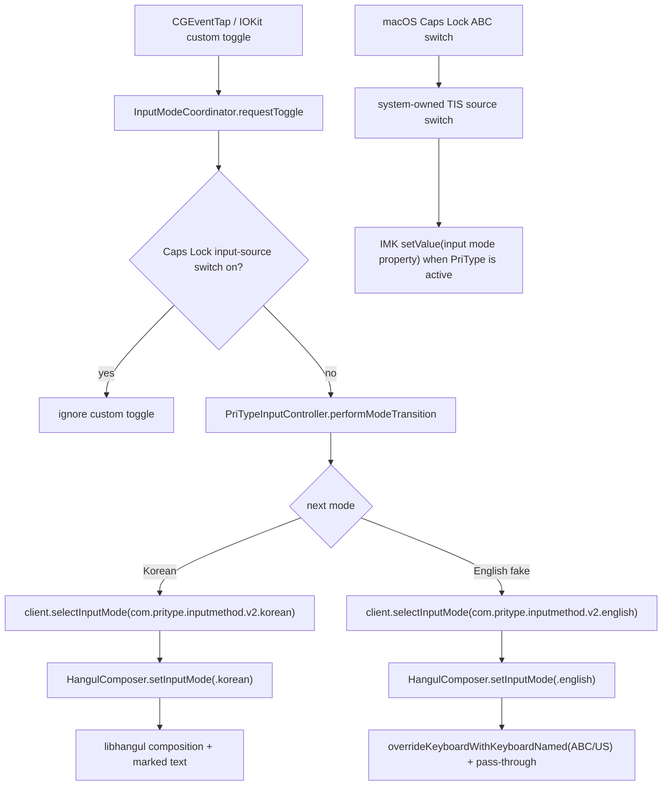
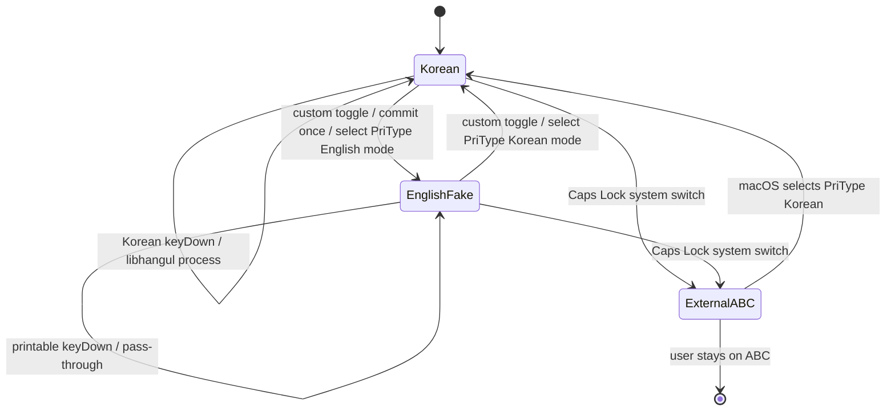
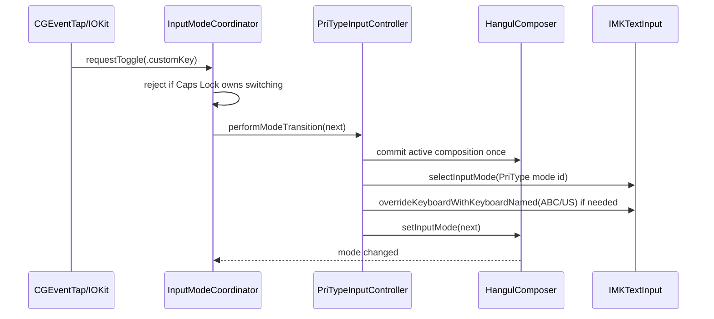

# PriType Input Architecture Hybrid Rollback Plan

작성일: 2026-05-31

> **SUPERSEDED (2026-06-01):** 정식 명세는 [UnifiedInputArchitecture.md](UnifiedInputArchitecture.md)로 이전되었다.
> 이 문서의 권장안인 "Korean/English 가짜 모드 2개 등록(선택지 B)"은 **채택하지 않았다**. 실제 구현은 더 단순한
> **단일 소스 하이브리드**(`com.pritype.inputmethod.v2` 단일 모드 + 순수 영어 pass-through)로 수렴했다.
> 가짜 모드 2개를 버린 근거는 UnifiedInputArchitecture.md §2.1을 보라. 이 문서는 설계 검토 시의 선택지 비교와
> 회귀 체크리스트 원본으로만 보존한다.

## 문서 상태와 사용 범위

이 문서는 현재 작업트리의 구현 상태나 구현 지침이 아니다. 아래 본문에서 `현재`, `현행`, `권장안`,
`구현`이라고 쓴 부분은 2026-05-31 설계 검토 당시의 문맥을 보존한 것이다.

현재 구조를 판단하거나 새 구현·회귀 검증을 설계할 때는
[UnifiedInputArchitecture.md](UnifiedInputArchitecture.md)와 [ARCHITECTURE.md](../ARCHITECTURE.md)만 따른다.
이 문서는 당시 선택지 비교와 결정 배경을 확인하는 용도로만 사용한다.

## 목적

현재 PriType에는 한/영 전환 직후 첫 글자가 씹히거나, 한글 모드 표시와 실제 입력 결과가 어긋나거나, 전환 경로가 누적되면서 지연이 생기는 문제가 반복적으로 관찰됐다. 이 문서는 `v2.6.5`의 통합 입력 방식과 `v2.7.2`의 macOS 입력 소스 통합 방식을 비교하고, 둘을 혼합하는 현실적인 설계 방향을 정한다.

결론부터 말하면, "진짜 macOS ABC 입력 소스를 선택하면서도 2.6.5처럼 한 프로세스 내부에서 무지연 전환"은 구조적으로 충돌한다. ABC가 실제 선택되면 PriType IMK controller는 더 이상 현재 텍스트 입력 세션을 소유하지 않기 때문이다. 대신 현실적인 하이브리드는 다음이다.

- PriType은 다시 2.6.5처럼 하나의 IMK 입력기 안에서 한/영 상태를 통합 관리한다.
- `ComponentInputModeDict`에는 단일 mode `com.pritype.inputmethod.v2`만 등록한다.
- 영어 내부 모드에서는 한글 조합을 하지 않고 키 입력을 가능한 한 그대로 pass-through한다.
- PriType 활성화와 내부 전환 시 IMK client의 `overrideKeyboardWithKeyboardNamed:`로 Apple ABC/US 계열 keyboard layout을 쓰게 하여 영어 입력은 시스템 키보드 레이아웃을 탄다.
- 사용자 지정 한/영 전환키는 더 이상 `TISSelectInputSource(com.apple.keylayout.ABC)`를 호출하지 않는다.
- Caps Lock의 "ABC 입력 소스 전환"은 계속 macOS 소유 기능으로 두며, 이 모드에서는 PriType 사용자 지정 전환키를 비활성화한다.

이 방향은 "진짜 ABC source"도 "별도 English input mode"도 아니지만, 사용자의 체감 요구인 빠른 전환, 첫 글자 안정성, 영어 입력의 기본 macOS 레이아웃 사용을 가장 단순하게 만족한다.

## 근거

### Apple / SDK API 근거

- Apple InputMethodKit `IMKServer` 문서는 input method가 `Info.plist`의 `InputMethodConnectionName`, `InputMethodServerControllerClass`, `tsInputMethodIconFileKey`, `tsInputMethodCharacterRepertoireKey` 등을 통해 등록된다고 설명한다.
- Text Input Source Services Reference는 `TISSelectInputSource`가 지정된 keyboard input source를 현재 source로 선택하고 이전 source를 deselect한다고 설명한다. 이 말은 실제 ABC source를 선택하면 PriType source가 선택 해제된다는 뜻이다.
- 같은 Reference는 `TISEnableInputSource`와 `TISSelectInputSource`가 enable-capable/select-capable 조건을 요구하고, input mode의 경우 parent input method가 enabled 상태여야 한다고 설명한다.
- 로컬 macOS SDK의 `TextInputSources.h`는 input method의 input mode가 `ComponentInputModeDict` top-level key 아래 `tsInputModeListKey`에 정의된다고 설명한다. 또한 input mode의 `TISInputSourceID`는 parent input method의 ID 또는 bundle ID로 시작하는 문자열이어야 한다고 설명한다.
- 로컬 SDK의 `IMKInputSession.h`는 `selectInputMode:`의 mode identifier가 `ComponentInputModeDict`의 key와 일치해야 한다고 설명한다.
- 같은 `IMKInputSession.h`는 `overrideKeyboardWithKeyboardNamed:`로 현재 keyboard layout을 override할 수 있고, 시스템 keyboard를 쓰려면 해당 keyboard의 unique name을 넘겨야 한다고 설명한다.

참고한 주요 원문:

- Apple Developer Documentation: `IMKServer.init(name:bundleIdentifier:)`
  https://developer.apple.com/documentation/inputmethodkit/imkserver/init%28name%3Abundleidentifier%3A%29
- Apple Developer Documentation: `NSTextInputContext.keyboardInputSources`
  https://developer.apple.com/documentation/appkit/nstextinputcontext/keyboardinputsources
- Text Input Source Services Reference
  https://leopard-adc.pepas.com/documentation/TextFonts/Reference/TextInputSourcesReference/TextInputSourcesReference.pdf
- Local SDK headers:
  - `/Library/Developer/CommandLineTools/SDKs/MacOSX.sdk/System/Library/Frameworks/Carbon.framework/Versions/A/Frameworks/HIToolbox.framework/Versions/A/Headers/TextInputSources.h`
  - `/Library/Developer/CommandLineTools/SDKs/MacOSX.sdk/System/Library/Frameworks/Carbon.framework/Versions/A/Frameworks/HIToolbox.framework/Versions/A/Headers/IMKInputSession.h`
  - `/Library/Developer/CommandLineTools/SDKs/MacOSX.sdk/System/Library/Frameworks/Carbon.framework/Versions/A/Frameworks/HIToolbox.framework/Versions/A/Headers/TextServices.h`

### 로컬 버전 비교 근거

`v2.6.5`:

- `Info.plist`에 `ComponentInputModeDict`가 있고, 단일 mode `com.pritype.inputmethod.v2`가 등록되어 있다.
- 앱 시작 시 status bar를 만들고, 사용자 지정 전환키는 `PriTypeInputController.sharedComposer.toggleInputMode()`를 직접 호출한다.
- `InputSourceManager`는 조회 중심이며 전환 hot path에 끼지 않는다.
- `HangulComposer.inputMode`가 실제 한/영 상태의 source of truth다.
- 장점: custom toggle은 PriType 내부 상태 전환이라 빠르고 첫 키 race가 작다.
- 단점: 영어가 실제 macOS ABC source가 아니며, 메뉴바/입력 소스 UI 통합이 덜 자연스럽다.

`v2.7.2`:

- `Info.plist`에서 `ComponentInputModeDict`가 제거되고, top-level `TISInputSourceID = com.pritype.inputmethod.v2.korean`이 추가되었다.
- 영어는 `com.apple.keylayout.ABC`, 한글은 PriType Korean source로 분리됐다.
- custom toggle은 `InputSourceManager.toggledInputMode()` -> `TISSelectInputSource(...)`를 호출하고, 이어서 IMK client에 `selectInputMode:`를 보조 호출한다.
- `PriTypeInputController`는 `setValue(_:forTag:)`로 `kTextServiceInputModePropertyTag`를 받아 composer mode를 맞춘다.
- `overrideKeyboardWithKeyboardNamed("com.apple.keylayout.US")`로 PriType 활성 시 roman layout을 보정한다.
- 장점: macOS 입력 소스 UI와 ABC 사용이 자연스럽다.
- 단점: TIS source 선택, IMK client mode 선택, composer state, 실제 key event 도착 순서가 분리되어 race가 생긴다. 이게 "한글 모드인데 영어가 쳐짐", "전환 직후 첫 키 씹힘", "계속 타자 중 전환하면 꼬임"의 핵심 구조적 원인이다.

현재 작업트리:

- HEAD는 `v2.7.2`이고, 그 위에 `2.7.4` 버전/패키징/설정창/일부 안정화 변경이 얹힌 dirty tree다.
- `InputSourceManager.ensureDefaultEnglishInputSourceEnabled()`는 이미 PriType 자신을 `TISEnableInputSource` 하지 않도록 보수화되어 있다.
- 설정창 UI는 최신 커밋의 설정창만 가져온 상태라, 입력 구조 재설계와는 분리해서 보존해야 한다.

## 프로젝트 영향 지도

이번 변경은 단순히 한 파일을 되돌리는 작업이 아니다. 한/영 전환은 app lifecycle, IMK session, TIS input source, composer state, 전역 키 캡처가 모두 맞물려 있으므로 파일별 책임을 먼저 고정해야 한다.

| 영역 | 주요 파일 | 현재 역할 | 하이브리드 계획 |
| --- | --- | --- | --- |
| 앱 lifecycle / 전환 진입점 | `Sources/PriType/main.swift` | 상태 메뉴, 설정창, 업데이트, custom toggle dispatch | 설정창/업데이트/상태 메뉴는 보존. custom toggle만 2.6.5처럼 controller/composer 내부 전환으로 되돌림. |
| IMK controller | `Sources/PriTypeCore/PriTypeInputController.swift` | `IMKInputController` lifecycle, focused client, mode property sync, key event 처리 | 핵심 수정 대상. `TISSelectInputSource(ABC)`와 `selectInputMode(English)` 의존을 제거하고 PriType 내부 mode 전환을 담당. |
| 한글 조합 state machine | `Sources/PriTypeCore/HangulComposer.swift`, `HangulComposerTypes.swift` | libhangul 조합, Return/Backspace/Hanja, English mode 처리 | 2.6.5처럼 `inputMode`를 source of truth로 복원. 영어 내부 mode는 문자 삽입을 하지 않는 pass-through로 유지하되 더블스페이스 마침표만 macOS 설정과 연동. |
| macOS 입력 소스 조회/정리 | `Sources/PriTypeCore/InputSourceManager.swift` | TIS 목록 조회, ABC/PriType 선택, stale source 정리 | hot path에서 제외. 조회/정리/마이그레이션만 담당하게 축소. |
| 전역 키 캡처 | `Sources/PriTypeCore/RightCommandSuppressor.swift`, `IOKitManager.swift` | 우측 Command/Option 등 modifier-only 키 감지 | 설정 가능한 키 감지만 유지하고, 전환 판단은 controller로 위임. modifier stripping은 계측 후 최소화. |
| 설정/사용자 옵션 | `Sources/PriTypeCore/SettingsWindowController.swift`, `PriTypeConfig.swift`, `ConfigurationManager.swift`, `L10n.swift` | 설정창 UI, 키 설정, Caps Lock 안내, 업데이트 | 현재 UX 개선분을 보존. Caps Lock on이면 custom 한/영 전환키 비활성화 정책 유지. |
| 앱별 문맥 감지 | `Sources/PriTypeCore/ClientContextDetector.swift` | Finder, KakaoTalk, terminal, browser 등 context | 기존 효과 확인된 compatibility guard만 보존. 새 구조에서는 hot path 감지 호출을 늘리지 않음. |
| 후보창 / 한자 | `CandidateWindowController`, `Hanja*` 관련 파일 | 후보창 좌표, 한자 변환 | 입력 구조와 분리해 보존. 단 mode 전환 직전 조합 commit 순서만 회귀 테스트. |
| 설치/패키징 | `Info.plist`, `Packaging/scripts/postinstall`, `build_release.sh`, `build_debug.sh` | 입력기 등록, 캐시 정리, signing/notarization | `Info.plist`는 `ComponentInputModeDict` 중심으로 변경. 설치 스크립트는 stale source 정리에 집중하고 자동 enable은 금지. |
| 테스트/벤치 | `Tests/PriTypeCoreTests`, `BENCHMARK.md` | 조합/문맥/성능 회귀 확인 | mode 전환 race, English fake pass-through, Caps Lock disabled state, Kakao focus-loss 테스트 추가. |

보존해야 하는 개선:

- 최신 설정창 UI/UX
- Caps Lock은 macOS 입력 소스 설정이 소유한다는 정책
- GoodNotes Return 중복/누락 보정 중 실제 효과가 확인된 부분
- KakaoTalk focus-loss 강제 commit처럼 재현 버그를 직접 해결한 compatibility guard
- 설치 시 PriType 자신을 자동 enable하지 않는 보수화

되돌릴 가능성이 높은 변경:

- custom toggle이 실제 `com.apple.keylayout.ABC`를 선택하는 경로
- 전환 직후 keydown을 막거나 replay하는 지연성 guard
- 영어 모드에서 PriType이 영어 문자를 직접 insert하거나 텍스트 편의 기능을 처리하는 경로
- 일반 typing hot path에서 TIS/AX/client context를 반복 조회하는 로직

명시적 non-goal:

- Apple 기본 ABC source와 완전히 같은 source ID를 위조하지 않는다.
- 앱별 bundle ID 하드코딩으로 한/영 race를 해결하지 않는다.
- 게임/Wine 전용 입력 엔진을 이번 1차 재설계에 포함하지 않는다.
- 메뉴바 아이콘/이름을 Apple 기본 입력기처럼 사칭하지 않는다.

## 설계 선택지 평가

### 선택지 A: 진짜 ABC source를 계속 선택하되 2.6.5 내부 toggle을 복원

평가: 권장하지 않음.

이 구조는 논리적으로 모순된다. 실제 ABC source가 선택되면 PriType은 현재 IMK 입력 세션을 소유하지 않는다. PriType이 custom toggle을 처리하려면 CGEventTap/IOKit이 전역에서 키를 잡아 다시 PriType source를 선택해야 한다. 결국 `TISSelectInputSource` race가 남는다.

문제:

- ABC -> PriType 복귀 때 첫 keyDown이 ABC에 들어갈 수 있다.
- PriType -> ABC 전환 때 `composer.inputMode`, menu bar source, focused client의 input mode property가 순간적으로 불일치할 수 있다.
- event replay나 키 입력 차단을 넣으면 지연과 씹힘 위험이 커진다.
- "진짜 ABC"를 얻는 대신 2.6.5의 장점인 단일 상태 machine을 잃는다.

사용 가능 범위:

- Caps Lock처럼 macOS가 직접 입력 소스 전환을 소유하는 경로에는 유지 가능하다.
- PriType custom toggle의 기본 경로로는 부적합하다.

### 선택지 B: PriType 내부 Korean/English fake mode 2개를 등록하고, English fake mode에서 ABC layout override + pass-through

평가: 권장.

이 구조는 2.6.5의 빠른 통합 state machine을 되살리면서, 2.7.2에서 필요했던 macOS layout 보정과 input mode UI 통합 일부를 유지한다.

핵심:

- PriType parent input method 아래 mode 2개를 등록한다.
  - `com.pritype.inputmethod.v2.korean`
  - `com.pritype.inputmethod.v2.english`
- 각 mode는 `tsInputModeDefaultStateKey = true`로 명시해 설치 후 Korean/English fake mode가 함께 enable될 수 있게 한다.
- `ComponentInputModeDict`에는 `TISUnifiedUIForInputMethodEnabling = true`를 둬 macOS 입력 소스 UI가 parent/mode를 한 흐름으로 다루도록 유도한다.
- custom toggle은 실제 `com.apple.keylayout.ABC`를 선택하지 않는다.
- custom toggle은 현재 IMK client에 `selectInputMode("com.pritype.inputmethod.v2.english")` 또는 `selectInputMode("com.pritype.inputmethod.v2.korean")`를 호출하고, 동시에 `HangulComposer.setInputMode(...)`를 갱신한다.
- English fake mode에서는 `HangulComposer`가 일반 printable key를 처리하지 않고 `false`를 반환하여 client/system path로 흘린다.
- PriType 활성화 또는 English fake mode 진입 시 `overrideKeyboardWithKeyboardNamed`를 호출한다.
  - 1차 후보: `com.apple.keylayout.ABC`
  - fallback 후보: `com.apple.keylayout.US`
  - 실제 동작은 설치 후 로그로 확인한다.

장점:

- 전환 hot path에서 `TISSelectInputSource(ABC)`를 제거한다.
- PriType이 계속 현재 IMK session을 소유하므로 첫 키 race가 줄어든다.
- 기존 `HangulComposer.inputMode` 중심 구조를 살릴 수 있다.
- 영어 입력은 PriType이 조합하지 않고 macOS keyboard layout에 맡길 수 있다.
- 설정창/키 설정은 지금 UX를 유지할 수 있다.

위험:

- 메뉴 막대에 PriType Korean/English mode가 두 줄로 보일 수 있다.
- `ComponentInputModeDict` 등록 방식이 잘못되면 과거의 한글 중복 문제가 재발할 수 있다.
- English fake mode는 "실제 ABC source"가 아니므로 일부 앱이 입력 소스 ID를 직접 검사하는 경우 ABC와 완전히 같지는 않을 수 있다.
- `overrideKeyboardWithKeyboardNamed("com.apple.keylayout.ABC")`가 모든 host에서 먹히는지 확인이 필요하다. 안 되면 `US` fallback을 사용해야 한다.

### 선택지 C: PriType English fake mode를 숨기고 실제 메뉴에는 한글만 노출

평가: 실험 가능하지만 1차 목표로는 부적합.

English fake mode를 hidden/internal로 두면 메뉴 중복은 줄일 수 있지만, `selectInputMode:`와 macOS input mode property 통합을 확인하기 어렵다. 현재 문제는 상태 불일치가 핵심이므로, 1차 POC에서는 Korean/English mode를 명시적으로 보이게 해서 로그와 UI를 같이 검증하는 편이 낫다.

### 선택지 D: 2.6.5로 완전 롤백

평가: 임시 안정화로는 가능하지만 제품 방향으로는 부족.

한/영 씹힘은 줄겠지만, 2.7대에서 정리한 macOS 설정 연동, Caps Lock 정책, 기본 영어 입력기와의 관계, 설정창 UX를 잃는다. 사용자 경험이 예전으로 돌아간다.

## 권장 아키텍처

권장 구조의 핵심은 "전환 요청은 하나의 coordinator가 받고, 실제 입력은 composer가 처리한다"는 분리다. 현재처럼 `AppDelegate`, `InputSourceManager`, `PriTypeInputController`, `HangulComposer`가 각각 mode를 조금씩 바꾸면 전환 순서가 host 앱과 TIS 타이밍에 따라 달라진다.

새 구조에서는 `InputModeCoordinator`를 얇게 추가한다.

- `RightCommandSuppressor` / `IOKitManager`는 전환키를 감지하고 `InputModeCoordinator.requestToggle(source:)`만 호출한다.
- `InputModeCoordinator`는 Caps Lock 정책, active controller 존재 여부, fallback 동작을 판단한다.
- `PriTypeInputController`는 현재 IMK client에 대한 imperative edge를 담당한다.
- `HangulComposer`는 조합 state machine과 실제 input mode만 소유한다.
- `InputSourceManager`는 TIS 조회/마이그레이션/캐시 정리만 담당하고, custom toggle hot path에서 빠진다.



### 상태 소유권

| 상태 | 소유자 | 설명 |
| --- | --- | --- |
| 전환 요청 정책 | `InputModeCoordinator` | Caps Lock 정책, controller fallback, 로그 계측을 한 곳에서 결정한다. |
| Custom toggle 현재 모드 | `HangulComposer.inputMode` | 2.6.5처럼 단일 source of truth로 둔다. |
| 현재 IMK mode 표시 | focused `IMKTextInput.selectInputMode(...)` | menu/input popup에 Korean/English fake mode를 반영한다. |
| 실제 source 선택 | macOS TIS | custom toggle 경로에서는 ABC를 선택하지 않는다. Caps Lock 경로만 macOS가 소유한다. |
| 영어 keyboard layout | host IMK session | `overrideKeyboardWithKeyboardNamed`로 ABC/US layout을 요청한다. |
| Caps Lock 정책 | macOS + settings UI | macOS Caps Lock switch가 켜져 있으면 PriType custom toggle은 비활성화한다. |
| 입력 소스 캐시 정리 | `InputSourceManager` | TIS 목록 조회와 stale entry 정리만 담당한다. mode 전환 owner가 아니다. |

### 핵심 불변식

1. custom toggle hot path에서는 `TISSelectInputSource`를 호출하지 않는다.
2. `HangulComposer.inputMode`를 바꾸는 write path는 `InputModeCoordinator -> PriTypeInputController -> HangulComposer` 하나로 제한한다.
3. `setValue(_:forTag:)`는 외부 TIS/IMK input mode property를 받아들이는 ingress일 뿐, custom toggle의 주 경로가 아니다.
4. mode 전환 전에 active composition은 한 번만 commit한다.
5. 전환 직후 첫 keyDown을 막거나 replay하지 않는다. mode 전환 자체가 충분히 즉시 완료되어야 한다.
6. 일반 keyDown hot path에서 TIS source 조회, AX 조회, UserDefaults JSON decode, 로그 문자열 생성이 없어야 한다.
7. English fake mode에서 PriType은 printable key를 insert하지 않는다. pass-through가 기본값이다.
8. Caps Lock은 macOS 입력 소스 전환 기능으로만 취급하고, PriType custom toggle과 동시에 동작시키지 않는다.

### 상태기계



`ExternalABC`는 PriType 내부 상태가 아니다. macOS가 실제 ABC source를 선택한 상태이며, 이 상태에서는 PriType이 현재 입력 세션을 소유한다고 가정하면 안 된다.

### 전환 트랜잭션

custom toggle의 원자적 순서는 다음으로 고정한다.



실패 처리:

- active controller가 없으면 composer mode만 바꾸지 않는다. 다음 activate에서 stale state가 적용되어 첫 글자가 엉킬 수 있기 때문이다.
- active controller가 없고 현재 TIS source가 PriType이 아니면 no-op이 맞다.
- active controller가 없지만 current adapter가 살아 있는 경우만 보수적으로 commit 후 no-op한다.
- `selectInputMode:`가 없거나 실패해도 `TISSelectInputSource(ABC)`로 우회하지 않는다. 이 경우 composer mode 변경 여부는 POC에서 로그로 검증한 뒤 결정한다.

### 입력 처리 원칙

1. custom toggle은 `TISSelectInputSource(ABC)`를 호출하지 않는다.
2. custom toggle은 가능하면 현재 `IMKTextInput`에 `selectInputMode:`를 먼저 호출하고, 같은 runloop에서 `composer.setInputMode`를 갱신한다.
3. `composer.inputMode == .english`일 때 일반 printable key는 PriType이 insert하지 않는다.
4. 영어 mode에서 한글 조합, 한자 후보, marked text는 동작하지 않는다.
5. 한글 mode에서만 libhangul 조합과 marked text를 사용한다.
6. Return/Backspace/Arrow/Tab의 조합 확정 규칙은 현재 안정화된 2.7.2/2.7.4 로직을 보존하되, English fake mode에서는 대부분 pass-through한다.
7. Secure Input과 Finder 바탕화면 immediate mode는 2.6.5/2.7.2에서 검증된 경로를 유지한다.

## 구현 명세

### 1. `Info.plist`

현재 top-level single Korean source 형태에서 다시 `ComponentInputModeDict` 중심으로 바꾼다.

권장 초안:

```xml
<key>TISInputSourceID</key>
<string>com.pritype.inputmethod.v2</string>
<key>TISIntendedLanguage</key>
<string>ko</string>
<key>ComponentInputModeDict</key>
<dict>
  <key>tsInputModeListKey</key>
  <dict>
    <key>com.pritype.inputmethod.v2.korean</key>
    <dict>
      <key>TISInputSourceID</key>
      <string>com.pritype.inputmethod.v2.korean</string>
      <key>TISIntendedLanguage</key>
      <string>ko</string>
      <key>tsInputModePrimaryInScriptKey</key>
      <true/>
      <key>tsInputModeScriptKey</key>
      <string>smKorean</string>
      <key>tsInputModeMenuIconFileKey</key>
      <string>icon.tiff</string>
      <key>tsInputModePaletteIconFileKey</key>
      <string>palette-ko.tiff</string>
    </dict>
    <key>com.pritype.inputmethod.v2.english</key>
    <dict>
      <key>TISInputSourceID</key>
      <string>com.pritype.inputmethod.v2.english</string>
      <key>TISIntendedLanguage</key>
      <string>en</string>
      <key>tsInputModeScriptKey</key>
      <string>smRoman</string>
      <key>tsInputModeMenuIconFileKey</key>
      <string>palette-en.tiff</string>
    </dict>
  </dict>
  <key>tsVisibleInputModeOrderedArrayKey</key>
  <array>
    <string>com.pritype.inputmethod.v2.korean</string>
    <string>com.pritype.inputmethod.v2.english</string>
  </array>
</dict>
```

검증 포인트:

- `smRoman` 문자열이 실제 TIS 등록에서 기대대로 동작하는지 확인한다.
- English fake mode가 메뉴에 "ABC"처럼 보이도록 `InfoPlist.strings`와 icon/label을 정리한다.
- 한글 중복 메뉴가 생기면 `tsVisibleInputModeOrderedArrayKey`와 `TISUnifiedUIForInputMethodEnabling` 사용 여부를 별도 실험한다.

### 2. `Sources/PriType/main.swift`

2.7.2의 `toggleLanguageInputSource()`는 제거하거나 역할을 바꾼다.

현재 문제 경로:

```swift
InputSourceManager.shared.toggledInputMode(...)
// 내부에서 TISSelectInputSource(ABC/PriType)
```

권장 경로:

```swift
InputModeCoordinator.shared.requestToggle(source: .customKey)
```

원칙:

- custom toggle에서 `TISSelectInputSource(com.apple.keylayout.ABC)` 금지.
- `main.swift`는 전환 정책을 직접 판단하지 않는다.
- `main.swift`는 `RightCommandSuppressor` / `IOKitManager` callback을 coordinator에 연결하는 배선만 담당한다.
- 앱 시작 시 `ensureDefaultEnglishInputSourceEnabled()`를 매번 호출하지 않는다. 필요하다면 postinstall 또는 명시적 설정 액션으로 이동한다.

### 3. `Sources/PriTypeCore/InputModeCoordinator.swift`

새로 추가할 얇은 조율 계층이다. 이 객체는 AppKit bridge가 아니라 mode 전환 command boundary다.

책임:

- custom toggle 요청을 받는다.
- Caps Lock input-source switch가 켜져 있으면 custom toggle을 무시한다.
- active `PriTypeInputController`가 있으면 controller에 전환 transaction을 맡긴다.
- active controller가 없으면 composer만 임의로 바꾸지 않는다.
- debug build에서 toggle latency와 첫 key mode mismatch를 계측한다.

비책임:

- TIS source 선택
- 한글 조합
- client text 삽입
- 앱별 bundle ID compatibility 판단

권장 초안:

```swift
public final class InputModeCoordinator: @unchecked Sendable {
    public static let shared = InputModeCoordinator()

    public enum ToggleSource: Sendable {
        case customKey
        case iokitFallback
    }

    public func requestToggle(source: ToggleSource) {
        guard !ConfigurationManager.shared.capsLockInputSourceSwitchEnabled else {
            DebugLogger.log("InputModeCoordinator: ignored custom toggle because Caps Lock owns switching")
            return
        }

        guard let controller = PriTypeInputController.sharedController else {
            DebugLogger.log("InputModeCoordinator: no active controller, toggle ignored")
            return
        }

        controller.performPriTypeModeTransition(source: source)
    }
}
```

### 4. `Sources/PriTypeCore/PriTypeInputController.swift`

추가/변경할 메서드:

```swift
public func performPriTypeModeTransition(source: InputModeCoordinator.ToggleSource) {
    let next = composer.inputMode.toggled
    commitActiveCompositionIfNeeded()
    selectPriTypeInputModeForCurrentClient(next)
    composer.setInputMode(next)
}

public func selectPriTypeInputModeForCurrentClient(_ mode: InputMode) {
    let modeID = mode == .korean
        ? "com.pritype.inputmethod.v2.korean"
        : "com.pritype.inputmethod.v2.english"
    client.selectInputMode(modeID)
    if mode == .english {
        syncRomanKeyboardLayout(for: client, force: true)
    }
}
```

유지할 것:

- `setValue(_:forTag:)`는 유지한다. macOS나 host가 input mode property를 바꿀 때 composer와 동기화하는 유용한 경로다.
- `recognizedEvents`는 `flagsChanged | keyDown` 유지 가능. 단 flagsChanged는 직접 조합에 쓰지 않는다.
- `lastKnownInputClient`는 한자/전환 fallback에 유용하므로 유지 가능.

제거/변경할 것:

- `.english` 선택 시 `inputModeID = "com.apple.keylayout.ABC"`로 client에 넘기는 경로를 제거한다.
- `InputSourceManager.toggledInputMode` 의존을 없앤다.
- `debugHandleLogCount`는 DEBUG 빌드 전용으로 유지한다.

### 5. `Sources/PriTypeCore/HangulComposer.swift`

2.6.5처럼 `inputMode`를 중심 상태로 유지하되, English fake mode는 더 순수한 pass-through로 바꾼다.

현재 English mode는 `TextConvenienceHandler.handleEnglishModeInput(...)`를 호출할 수 있다. 하지만 영어를 시스템 기본 레이아웃에 맡기려면 PriType이 영어 문자를 직접 insert하지 않는 편이 더 안전하다.

권장:

```swift
if inputMode == .english {
    if hasActiveComposition {
        commitComposition(delegate: delegate)
    }
    localTextBuffer = ""
    return false
}
```

주의:

- Control+Space 같은 PriType custom toggle 처리는 composer가 아니라 `RightCommandSuppressor`/controller 경로로 올리는 편이 단순하다.
- macOS 더블스페이스 마침표는 English fake mode에서 PriType이 직접 처리하지 않는다.
- Korean mode의 더블스페이스 마침표는 현재 macOS 설정 연동 정책을 유지한다.

### 6. `Sources/PriTypeCore/InputSourceManager.swift`

역할을 축소한다.

유지:

- enabled input source 목록 조회
- stale HIToolbox entry cleanup
- PriType/Apple Korean 중복 제거

변경:

- custom toggle용 `selectInputMode(.english)`에서 `com.apple.keylayout.ABC`를 선택하는 경로 제거
- `ensureDefaultEnglishInputSourceEnabled()`의 자동 ABC 추가는 선택 기능으로 낮춘다. English fake mode가 성공하면 필수 아님.
- PriType 자신을 `TISEnableInputSource` 하는 코드는 계속 금지한다. 시작 시 macOS 확인창 재발 위험이 있다.

### 7. `RightCommandSuppressor` / `IOKitManager`

역할은 "키를 잡아서 controller에 toggle 요청"으로 축소한다.

유지:

- 설정 가능한 key binding
- modifier-only key press 즉시 전환
- Hanja key
- CGEventTap 실패 시 IOKit fallback

주의:

- modifier stripping은 최소화한다. 전환 직후 다음 문자에 modifier가 섞이는 문제를 막기 위한 현재 코드가 오히려 문자 꼬임을 만들 수 있으므로 POC에서 계측 후 유지 여부 결정.
- Caps Lock은 계속 custom binding으로 저장하지 않는다.

### 8. 설치/마이그레이션

`Packaging/scripts/postinstall`에서 정리해야 할 stale 상태:

- 과거 top-level `com.pritype.inputmethod.v2.korean` single source
- 과거 `com.pritype.inputmethod.v2.english` 실험 entry
- Apple Korean input mode 중복 제거 로직은 신중히 유지하되, Apple 기본 한국어 입력기를 무조건 제거하는 느낌이 나면 UX상 위험하다.
- `AppleSelectedInputSources`와 `AppleInputSourceHistory`에서 stale PriType IDs를 정리한다.
- LaunchServices/TIS cache refresh는 기존 안전 범위 안에서 유지한다.

금지:

- 설치/시작 시 PriType 자신을 `TISEnableInputSource` 하지 않는다.
- 설치/시작 시 알림 권한 요청을 띄우지 않는다.

## 구현 단계

### Phase 0: 별도 브랜치와 기준선 고정

목표:

- 현재 dirty tree에서 설정창/문서/버전 변경을 보존할지 먼저 결정한다.
- 입력 구조 변경은 별도 브랜치에서 진행한다.

권장 브랜치:

```bash
git switch -c codex/hybrid-input-architecture
```

기준:

- 기능 기준은 `v2.6.5`의 internal composer toggle
- UX 기준은 현재 설정창
- 버그픽스 기준은 GoodNotes Return, KakaoTalk focus-loss commit처럼 이미 효과가 확인된 호환성 수정만 선별 유지

### Phase 1: 등록 구조 POC

작업:

- `Info.plist`에 Korean/English fake mode `ComponentInputModeDict`를 추가한다.
- 앱 빌드/설치 후 입력 소스 메뉴를 확인한다.
- menu bar icon/name이 한글/영어 mode에 맞게 바뀌는지 확인한다.
- 중복 한글 source가 생기는지 확인한다.

성공 기준:

- 입력 소스 목록에 PriType이 중복 폭증하지 않는다.
- Korean/English fake mode가 TIS에서 조회된다.
- `selectInputMode("com.pritype.inputmethod.v2.english")`가 host에서 실패하지 않는다.

중단 기준:

- 설치마다 한글 입력기가 중복으로 늘어난다.
- English fake mode가 선택 불가능하거나 parent enable 문제를 만든다.

### Phase 2: custom toggle hot path 롤백

작업:

- `AppDelegate.toggleLanguageInputSource()`에서 `InputSourceManager.toggledInputMode()` 제거.
- `InputModeCoordinator` 추가.
- controller에 `performPriTypeModeTransition(source:)` 추가.
- `InputSourceManager.selectInputMode(.english)`에서 ABC 선택하는 경로 제거 또는 custom toggle에서 사용하지 않게 변경.
- `HangulComposer.setInputMode()`를 controller 전용 적용 지점으로 두고 `inputMode`를 source of truth로 복원.
- active controller가 없을 때 composer만 단독 toggle하지 않도록 한다.

성공 기준:

- 우측 Command 연타 중 첫 글자가 이전 mode로 들어가지 않는다.
- 한글 mode 표시와 실제 한글 조합 상태가 일치한다.
- English fake mode에서 일반 입력은 PriType이 consume하지 않는다.
- 전환키 press callback에서 TIS 조회/선택이 발생하지 않는다.

### Phase 3: English fake pass-through와 keyboard override 검증

작업:

- English fake mode에서 printable key를 `false`로 pass-through.
- controller 활성화/English mode 진입 시 `overrideKeyboardWithKeyboardNamed` 호출.
- `com.apple.keylayout.ABC`와 `com.apple.keylayout.US`를 각각 테스트한다.

성공 기준:

- English fake mode에서 영문 입력이 일반 ABC/US 레이아웃처럼 들어간다.
- 한글 자판 상태에서 English fake mode로 바꿔도 로마자가 들어간다.
- 앱별로 `event.characters`가 한글/이상 문자로 오지 않는다.

### Phase 4: Caps Lock 정책 유지/정리

작업:

- macOS Caps Lock input-source switch가 켜져 있으면 PriType custom toggle UI/동작 비활성화 유지.
- Caps Lock path에서는 실제 ABC source 사용을 허용한다.
- 이때 PriType internal English fake mode와 macOS ABC path가 섞이지 않게 로그와 설정 문구를 정리한다.
- `InputModeCoordinator`에서 Caps Lock 정책을 한 번만 판단한다.

성공 기준:

- Caps Lock이 켜져 있으면 PriType custom toggle은 동작하지 않는다.
- Caps Lock이 꺼져 있으면 custom toggle은 PriType internal fake mode만 전환한다.
- Caps Lock 경로와 custom toggle 경로가 같은 key event에서 동시에 실행되지 않는다.

### Phase 5: 앱 호환성 회귀 테스트

필수 앱/환경:

- TextEdit: 기본 IMK lifecycle
- Safari/Chrome: 웹 텍스트필드
- Codex/ChatGPT: Electron/Chromium 계열
- KakaoTalk: marked text/focus-loss 문제
- Finder: 바탕화면 ghost window 방지
- Terminal/iTerm: pass-through/shortcut 영향
- GoodNotes: Return 처리
- MapleStory/Wine/Crossover: 별도 전용 로직 없이 최소 정상 입력 여부

핵심 시나리오:

- `한글 -> 영어 -> 한글` 빠른 연속 전환 중 입력
- 전환키와 다음 문자 거의 동시에 입력
- 한글 조합 중 전환
- 한글 조합 중 앱 포커스 이동
- Backspace 길게 누르기
- Return/Enter 한 번 입력
- Hanja 후보창 호출 및 좌표

성공 기준:

- 한글 mode에서 영어가 섞여 나오는 사례 0회
- 전환 직후 첫 keydown 씹힘 0회
- release build에서 Backspace 체감 딜레이 없음
- 카카오톡 focus-loss 후 밑줄/마지막 글자 덮어쓰기 재발 없음
- Finder ghost window 재발 없음

## 과거 계측 제안 (폐기됨)

> **폐기된 비안전 예시 — 구현 금지:** 아래 형식은 당시 제안 원문을 보존한 것이며 현재 진단 계약이 아니다.
> raw `client`, `chars`, `modeID`, `keyCode`는 입력 내용이나 client 식별 정보를 노출할 수 있으므로 구현하거나
> 복사하지 않는다. 현재 입력 진단은 [UnifiedInputArchitecture.md](UnifiedInputArchitecture.md)의
> content-free structured metadata 계약만 사용한다.

당시에는 디버그 빌드에 다음 로그를 추가하자는 제안이었다.

```text
ToggleRequest source=CGEventTap key=RightCommand oldMode=korean nextMode=englishFake
InputModeSelect client=... modeID=com.pritype.inputmethod.v2.english result=sent
ComposerModeChanged old=korean new=english
FirstKeyAfterToggle keyCode=... chars=... composerMode=english consumed=false latencyMs=...
KeyboardOverride requested=com.apple.keylayout.ABC result=...
```

당시 제안도 릴리즈 빌드에서는 로그 문자열 생성 자체가 없어야 한다고 보았다.

당시 성능 기준:

- custom toggle callback 내부 동기 작업: 목표 1ms 미만
- toggle부터 composer mode 변경 완료까지: 목표 5ms 미만
- 첫 keydown 도착 시 mode mismatch: 0회
- 일반 typing hot path에서 TIS/AX 호출: 0회
- Finder/Hanja/secure input 같은 예외 경로는 기존처럼 제한적으로 허용

## 위험과 대응

| 위험 | 원인 | 대응 |
| --- | --- | --- |
| 입력 소스 메뉴 중복 | `ComponentInputModeDict`와 top-level source ID 혼합 | POC에서 registration shape 먼저 검증. stale IDs를 postinstall에서 정리. |
| English fake가 실제 ABC와 다름 | PriType parent source가 계속 선택됨 | keyboard override + pass-through로 체감 동일성을 확보. 진짜 ABC가 필요한 경우 Caps Lock path 사용. |
| `overrideKeyboardWithKeyboardNamed` 미동작 | host가 override를 무시하거나 ID가 다름 | ABC/US 후보 모두 테스트하고 host별 로그 수집. |
| Caps Lock과 custom toggle 혼선 | macOS source switch와 PriType internal mode switch가 동시에 존재 | 설정 UI에서 둘 중 하나만 active. Caps Lock on이면 custom toggle disabled. |
| 카카오톡 조합 회귀 | lifecycle commit/marked text host 버그 | 현재 효과 확인된 app-deactivate force commit은 유지하되, English fake mode와 분리. |
| 게임/Wine 입력 회귀 | host가 IMK marked text를 비정상 처리 | 전용 로직은 기본 포함하지 않고, POC 후 별도 compatibility policy로 판단. |

## 최종 권장안

실제 구현은 다음 방향으로 시작한다.

1. `v2.6.5`의 internal `HangulComposer.inputMode` 중심 구조를 복원한다.
2. `v2.7.2`의 실제 ABC source 선택 경로는 custom toggle에서 제거한다.
3. `ComponentInputModeDict`로 PriType Korean/English fake modes를 등록한다.
4. English fake mode는 ABC/US keyboard layout override + pass-through로 구현한다.
5. Caps Lock은 기존처럼 macOS 입력 소스 전환 전용으로 두고, 이때 PriType custom toggle은 비활성화한다.
6. 설정창 UI, GoodNotes Return, KakaoTalk focus-loss commit, 패키징 보수화처럼 이미 유효한 개선은 보존한다.

이 설계가 가장 현실적인 이유는 명확하다. 한/영 씹힘과 지연의 핵심은 "실제 입력 소스 선택"과 "PriType 내부 composer mode"가 서로 다른 비동기 시스템이라는 점이다. 따라서 custom toggle의 기본 경로에서 실제 ABC source 선택을 제거해야 한다. 대신 PriType 내부에 fake English mode를 만들고, 시스템 keyboard layout override를 통해 영어 입력 체감을 맞추는 것이 2.6.5의 안정성과 2.7대의 macOS 통합을 가장 덜 위험하게 섞는 방법이다.

## 구현 전 확인 명령

버전 비교:

```bash
git diff --stat v2.6.5..v2.7.2 -- Sources/PriTypeCore Sources/PriType Info.plist Packaging/scripts Package.swift Tests/PriTypeCoreTests
git show v2.6.5:Info.plist | plutil -p -
git show v2.7.2:Info.plist | plutil -p -
git diff v2.6.5..v2.7.2 -- Sources/PriType/main.swift Sources/PriTypeCore/PriTypeInputController.swift Sources/PriTypeCore/InputSourceManager.swift
```

입력 소스 캐시 확인:

```bash
defaults read ~/Library/Preferences/com.apple.HIToolbox.plist AppleEnabledInputSources
defaults read ~/Library/Preferences/com.apple.HIToolbox.plist AppleSelectedInputSources
defaults read ~/Library/Preferences/com.apple.HIToolbox.plist AppleInputSourceHistory
```

빌드/검증:

```bash
swift build -c debug --product PriType
swift test
./build_debug.sh
./build_release.sh
```

디버그 로그:

```bash
log stream --style compact --predicate 'process == "PriType" OR subsystem CONTAINS "pritype"'
```

설치 후 확인:

```bash
plutil -p ~/Library/Input\ Methods/PriType.app/Contents/Info.plist
mdls -name kMDItemCFBundleIdentifier ~/Library/Input\ Methods/PriType.app
```

## 완료 정의

1차 구현은 다음 조건을 모두 만족해야 완료로 본다.

- custom 한/영 전환키 경로에서 `TISSelectInputSource(com.apple.keylayout.ABC)` 호출이 없다.
- `HangulComposer.inputMode`와 focused client input mode가 한 runloop 안에서 같은 방향으로 갱신된다.
- English fake mode에서 PriType은 일반 printable key를 consume하지 않는다.
- 한글 mode에서 빠른 연속 전환 중 영어가 섞여 들어가는 재현 사례가 없어야 한다.
- Backspace/Return/Hanja/Finder/KakaoTalk 회귀 테스트가 통과해야 한다.
- 설치 또는 재부팅 때 PriType 추가 확인창이 다시 뜨지 않아야 한다.
- release build의 일반 typing hot path에 TIS/AX/log 문자열 생성이 없어야 한다.
